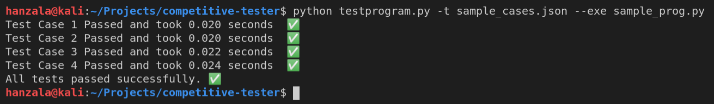

# competitive-tester
### A python script to test a program against some input for some desired output 

#### To add a test case, create a JSON file and use the format given below
```json
[
    {
        "input": [
            "3",
            "5 4",
            "10 2 3 4 5",
            "7 15",
            "1 2 3 4 5 6 7",
            "5 5",
            "10 9 8 7 6"
        ],
        "output": ["7", "0", "15"]
    }
]
```

#### To add multiple test cases
```json
[
    {
        "input": [
            "3",
            "5 4",
            "10 2 3 4 5",
            "7 15",
            "1 2 3 4 5 6 7",
            "5 5",
            "10 9 8 7 6"
        ],
        "output": ["7", "0", "15"]
    },
    {
        "input": [
            "3",
            "5 4",
            "10 2 3 4 5",
            "7 15",
            "1 2 3 4 5 6 7",
            "5 5",
            "10 9 8 7 6"
        ],
        "output": ["7", "0", "15"]
    },
    {
        "input": [
            "3",
            "5 4",
            "10 2 3 4 5",
            "7 15",
            "1 2 3 4 5 6 7",
            "5 5",
            "10 9 8 7 6"
        ],
        "output": ["7", "0", "15"]
    }
]
```
#### Linux: 
Step 1: `chmod +x testprogram.py` (only for the first time)

Step 2: `chmod +x sample_prog.py` (only for the first time)

Step 3: `python testprogram.py -t sample_cases.json --exe sample_prog.py`

#### Windows: 
`python.exe .\testprogram.py --exe a.exe -t .\sample_cases_new.json`

#### Output:

